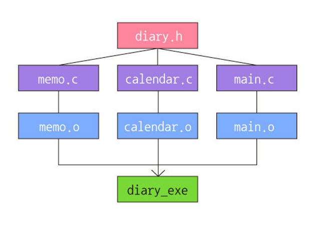

# Makefile 사용하기

## make & Makefile 이란

쉘에서 컴파일을 할때 make 명령어를 이용해서 컴파일 경우가 왕왕 있다. Makefile이라는 파일을 작성하고 여기에 컴파일 명령을 입력해둔뒤, 쉘에서 make 명령을 이용해서 컴파일을 한다. `make`는 컴파일 자동화 유틸리티이다.

## 예제

다음과 같은 구조로 diary_exe 파일을 생성한다고 가정해보자.



### 기존 방법으로 컴파일하기

기존 방법으로는 다음과 같은 명령어로 컴파일 할 수 있다.

```bash
gcc -c -o memo.o memo.c
gcc -c -o calendar.o calendar.c
gcc -c -o main.o main.c
```

위 명령어를 통해서 소스파일을 컴파일하여 각 object 파일을 생성한다. -c 옵션은 object 파일 생성을 의미한다.

이제 다음 명령어를 통해 최종 diary_exe 실행파일을 생성할 수 있다.

```bash
gcc -o diary_exe memo.o calendar.o main.o
```

> 위 예제처럼 파일이 3개 밖에 없는 경우 각 파일을 컴파일 하고 최종 실행파일을 생성하는 것이 그리 복잡하지 않다. 그러나 만약 c 소스코드가 10000개가 되고, 그것들의 종속 관계도 복잡하다면, 기존 방법으로 컴파일하기 쉽지 않을 것이다.

### Makefile을 작성하여 개선하기

Makefile을 작성하는 규칙은 다음과 같다.

```Makefile
매크로선언

목표 파일 : 종속 파일
(탭)    명령어
```

- 매크로선언 : Makefile에서 중복적으로 사용되는 코드를 일종의 변수처럼 선언하여 사용하는 것이다. c언어 #define을 통해 매크로 상수를 선언하는 것이라고 보면 된다.
- 목표 파일 : 생성하고자 하는 목표 파일이다. 이 예제에서는 `diary_exe`가 된다.
- 종속 파일 : 목표 파일을 만들기 위해서 필요한 객체들이다. 이 예제에서는 `memo.o`, `main.o`, `calendar.o` 들이 된다.
- 명령어 : 목표 파일을 생성하기 위해 수행해야 하는 명령어들을 의미한다.

diary_exe 파일을 생성하기 위한 Makefile은 다음과 같이 작서할 수 있다.

```Makefile
diary_exe : memo.o calendar.o main.o
        gcc -o diary_exe memo.o calendar.o main.o

memo.o : memo.c
        gcc -c -o memo.o memo.c

main.o : main.c
        gcc -c -o main.o main.c

clean :
        rm *.o diary_exe
```

소스코드과 object 파일이 있는 곳에 Makefile을 작성하고 쉘에서 다음 명령어를 입력하면 `diary_exe` 파일이 생성된다.

```bash
/$ make
```

`clean` 과 같이 종속 파일들이 명시되지 않는 것들은 `더미 파일`이라고 한다. 더미 파일은 파일이 만들어지지 않는다. 해당 명령어는 디렉토리에 이미 관련 object 파일과 diary_exe 파일이 존재하는 경우 그것들을 삭제하는 명령이다.

`Makefile`의 이름은 꼭 Makefile 일 필요는 없다. make 명령에서 -f 옵션을 주면 다른 이름을 가진 Makefile을 실행시킬 수도 있다.

아직까지는 쉘에서 하는 명령어를 그대로 파일에 옮겨 놓은 수준이다. 이제 매크로를 생성해서 Makefile을 개선시켜보자.

### 매크로를 사용하여 Makefile 개선하기

```Makefile
CC = gcc
TARGET = diary_exe

$(TARGET) : memo.o calendar.o main.o
        $(CC) -o $(TARGET) memo.o calendar.o main.o

memo.o : memo.c
        gcc -c -o memo.o memo.c

main.o : main.c
        gcc -c -o main.o main.c

clean :
        rm *.o diary_exe
```

위 코드에서 알수 있듯이 매크로는 Makefile에서 사용하는 일종의 변수이다. 파일 상단에 다음과 같은 규칙으로 작성한다.

```Makefile
VAR = 내용
```

Makefile에서 매크로를 이용하여 string을 치환할 경우 반드시 $ 기호와 함께 소괄호 또는 대괄호로 감싸야 한다. 그리고 매크로를 사용하는 코드보다 매크로 선언이 먼저 있어야 하며 `, ; "`와 같은 기호들은 매크로 변수로 사용할 수 없다.

### 내부 매크로를 사용하여 좀 더 개선하기

사용자가 직접 선언하는 매크로 말고도 미리 선언되어 있는 매크로 종류가 있다.

- `$@` : 현재 명령어의 목표 파일
- `$^` : 현재 항목의 종속 항목 리스트

```Makefile
CC = gcc
CFLAGS = -W -WALL
TARGET = diary_exe
OBJECTS = main.o memo.o calendar.o

all : $(TARGET)

$(TARGET) : $(OBJECTS)
        $(CC) $(CFLAGS) -o $@ $^

clean :
        rm *.o diary_exe
```

- all 은 타겟 파일을 여러개 생성할때 작성한다.
- main.o memo.o calendar.o 의 경우 컴파일 코드가 없는데, make 유틸리티가 알아서 이름이 동일한 소스코드를 이용하여 ojbect 코드를 생성한다.
