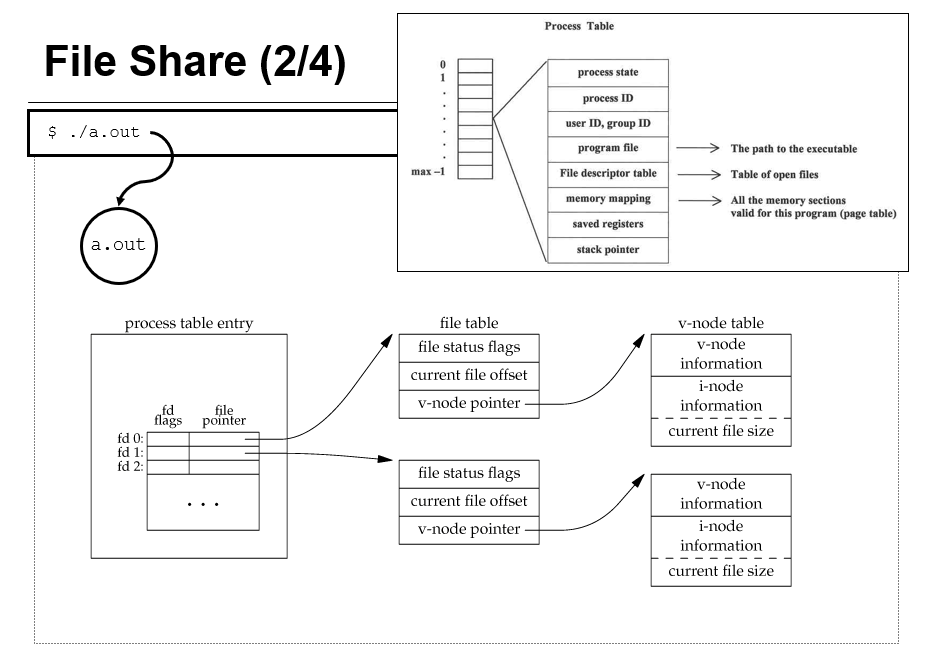

# Ch02 The File

- File : 데이터를 저장하는 컨테이너이다. 파일은 일련의 바이트들로 구성되어 있으며, 각 바이트는 저장장치상에서 주소가 있어서 direct 접근이 가능하다. 파일의 형식은 운영체제에 제한받지 않는다. 또한 유닉스에서는 외부 장치도 파일로 취급한다.
- File system : 파일을 저장하고 관리하는 시스템이다. 파일의 접근과 사용을 쉽게해준다. CD-ROM, hard disk와 같은 저장장치를 사용할 수도 있다.
- 파일 시스템에 대한 system call에는 다음과 같은 것들이 있다
  - open, creat, close, read, write, fcntl, lseek, unlink, remove

## 2.1 UNIX file access primitive

- open : 파일을 연다
- creat : 파일을 생성한다
- close : 열려진 파일을 닫는다
- read : 파일을 읽는다
- write : 파일에 쓴다
- lseek : 파일 포지션을 이동시킨다
- unlink : 파일을 제거한다.
- remove : 파일을 제거한다.
- fcntl : 열려져 있는 파일을 조작한다

위 함수들은 ANSI C 표준 함수가 아니다. 대신 POSIX 표준함수이다. 또한 I/O 동작시 버퍼를 사용하지 않기 때문에 Unbuffered I/O라고 한다.

### File descriptor

UNIX 시스템에서는 열려져 있는 파일들에 대해서 해당 파일을 나타내는 (음이 아닌) 정수를 이용해여 파일을 관리한다. 이러한 정수를 File descriptor라고 한다.

open이나 create와 같은 함수를 호출할때 반환된다. 또한 read나 write과 같은 함수의 인자로서 전달되기도 한다.

UNIX 쉘을 이용해서 프로그램을 실행시킴과 동시에 생성되는 기본 File descriptor가 존재한다.

- standard input (0) : 키보드로부터 입력을 받는다.
- standard output (1) : 모니터에 출력을 한다.
- standard error (2) : 모니터에 에러 출력을 한다. 정상적인 출력과 구분하기 위해서 만들어졌다.

### open

파일을 연다.

```c
#include <fcntl.h>

int open(const char* pathname, int flags, [mode_t mode]);
```

- 성공시 해당 파일에 대한 File descriptor 반환, 실패시 -1
- flags : 옵션에 적절한 인자를 전달하여 파일을 열때 어떤 목적으로 열 것인지를 설정할 수 있다.
  - O_RDONLY : 읽기 전용으로 오픈
  - O_WRONLY : 쓰기 전용으로 오픈
  - O_RDWR : 읽기 쓰기 모드
  - 이들은 | 기호로 결합할 수 없다. 즉, 3가지 중 하나만 지정할 수 있다.
  - O_APPEND : 쓰기 전용으로 열었을 때 이미 작성되어 있는 바이트 맨 뒤에서 부터 추가하기
  - O_CREAT : 파일이 없다면 새로 생성하기
  - O_EXCL : 파일이 이미 있다면 에러를 발생시킨다
  - O_TRUNC : 파일을 열때 이미 있는 파일의 경우에 내용을 지운다.
- mode : 파일에 대한 보안 권한을 설정하는 부분이다. create 되는 경우에만 유효하다.

```c
open(filename, O_WRONLY | O_CREAT); // 파일 쓰기 전용으로 열기, 없으면 새로 생성
open(filename, O_WRONLY | O_CREAT | O_EXCL); // 파일 쓰기전용으로 열기, 없으면 새로 생성, 이미 존재하면 에러
open(filename, O_WRONLY | O_CREAT | O_TRUNC); // 파일 쓰기전용으로 열기, 없으면 새로 생성, 이미 존재하면 파일내용 삭제
```

> Primitive system data type : ssize_t, size_t, mode_t와 같이 _t로 끝나는 자료형들. 기본적으로 primitive type에 대한 재정의이다. UNIX는 여러 기관에서 다양한 개발되어짐에 따라 시스템 콜에서 사용하는 매개변수나, 반환형의 타입의 기관마다 달라질 수 있다. 동일한 코드를 많은 UNIX 시스템에서 사용할 수 있게 하려고 기본 타입에 대한 재정의를 하였다. \<sys/types.h\>에 지정되어 있다. 이 헤더 파일은 \<unistd.h\>가 포함한다.

### File Permission


- File Permission이란 파일에 대해서 읽거나 쓰거나 실행할 수 있는 권한을 의미한다.
- bash에서 chmod(change mode) 명령을 통해 변경할 수 있다.
  - 8진수로 변경하는 방법 : `chmod 764 파일이름`
  - 기호로 변경하는 방법 : `chmod 변경하고자 하는 범위 (+|-) 권한기호 파일이름`

### create

파일을 생성하고 쓰기모드로 연다.

```c
#include <fcntl.h>

int fd = creat(const char* pathname, mode_t mode);
```

- 성공시 해당 파일 지시자
- 이미 파일이 존재하는 경우 해당 파일 내용을 삭제하고 연다.
- mode의 경우 새로 파일을 생성하는 경우에만 유효하다.

```c
fd = creat("test", 0644);

==

fd = open("test", O_WRONLY | O_CREAT | O_TRUNC, 0644);

```

### Owner and permission of a new file

- 파일을 생성하기 위해서는 해당 파일이 만들어지는 디렉토리에 대한 write 권한이 필요하다. 디렉토리 역시 파일이라 권한이 존재하기 때문이다.
- 파일의 owner는 파일을 생성하는 process를 실행시킨 effective user_id로 설정된다.
- 파일이 속한 그룹은 파일을 생성하는 process를 실행시킨 effective group_id로 설정된다.

### close

열었던 파일을 닫는다. 모든 파일은 open으로 열어서 사용한 다음 close를 이용해서 닫아주는 것이 좋다. 프로그램이 종료될 때 모든 파일이 닫히기 하지만 명시적으로 닫아주어 혹시모를 에러를 방지하는 것이 좋다.

```c
#include <fcntl.h>

int close(int fd);
```

- 성공시 0, 실패시 -1
- fd : 닫고자 하는 파일의 File desciptor

### read

파일로부터 데이터를 읽는다. 그 다음 file position을 갱신한다.

```c
#include <unistd.h>

ssize_t read(int fd, char* buffer, size_t size);
```

- 성공시 읽어들인 바이트수, 파일 끝 도달시 0 ,실패시 -1
- fd : 읽어들일 파일의 File descriptor
- buffer : 읽은 데이터를 저장할 버퍼
- size : 읽어들일 데이터 크기

> ssize_t : signed integer, size_t : unsigned integer

### write

파일에 데이터를 쓴다

```c
#include <unistd.h>

ssize_t write(int fd, char* buffer, size_t size);
```

- 성공시 파일에 쓴 바이트 수, 실패시 -1 또는 size보다 작은값
- fd : 데이터를 쓸 파일의 File descriptor
- buffer : 파일에 쓸 데이터를 저장하고 있는 버퍼
- size : 파일에 쓸 바이트수
- 이미 존재하는 파일을 쓰기위해 열면 원래 있던 파일에 있던 데이터 위에 새로운 바이트가 overwriting 된다.(뒤에 새로 추가하기 위해서는 O_APPEND 플래그를 사용한다.)

### lseek

파일에서 현재 접근하여 사용하고 있는 커서 위치를 변경시킨다.

```c
off_t lseek(int fd, off_t offset, int starg_flags);
```

- 성공시 새로운 파일 포지션 위치, 실패시 -1 반환
- offset : 시작 위치로부터 파일 포지션을 이동시킬 거리. 음수도 가능하다.
- 시작 위치 : SEEK_SET, SEEK_CUR, SEEK_END가 있다. 각 파일의 시작위치, 현재 파일 포지션 위치, 파일의 끝 위치를 가리킨다. 파일 시작 위치 전으로 이동하는 것은 불가능하고, 파일 끝 위치 다음으로 이동하는 것은 가능하다.

### File descriptor에 대한 관찰(File share)

실행되고 있는 process는 실행에 필요한 각종 정보들을 process table이라는 자료구조에 저장한다. 이 table의 entry 중 프로세스에서 open한 파일들을 관리하는 것이 있다. 이 entry는 file descriptor와 해당 file descriptor에 대응하는 file table entry에 대한 포인터를 필드로 갖는 테이블이다.

해당 table의 entry에서 file table entry의 포인터를 나타내는 필드가 있다고 하였다. 운영체제는 프로세스에서 사용하는 파일들을 관리하는 File table을 가지고 있다. 이 File table에는 해당 File table을 가리키는 file descriptor의 개수, 해당 File의 vnode table entry에 대한 포인터, 현재 파일 포지션 위치, 파일 상태 플래그 등을 저장한다.

각각의 open file은 vnode structure를 가지고 있다. 이는 해당 파일의 타입, 해당 파일에서 사용하는 함수의 위치 등을 저장하고 있다.



### dup, dup2

File descriptor를 복사한다.

```c
int dup(int filedes);
int dup2(int filedes, int filedes2);
```

- 성공시 새로 생성된 file descriptor 실패시 -1
- dup : File descriptor를 복사한다.
- dup2 : 2번째 인자로 사용하던 파일을 close하고 첫번째 인자에 대한 fd를 두번째 인자에 복사한다.


### fcntl

이미 열려져 있는 파일을 조작할 때 사용한다.

```c
#include <fcntl.h>

int fcntl(int fd, int cmd, ...);
```
