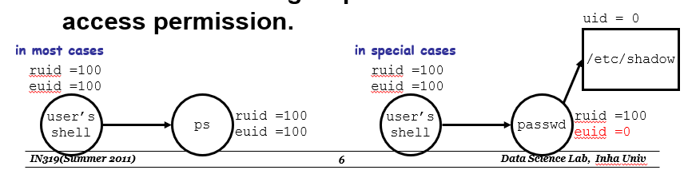
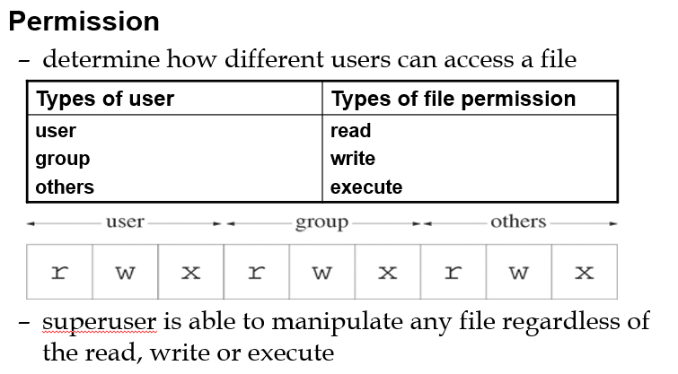
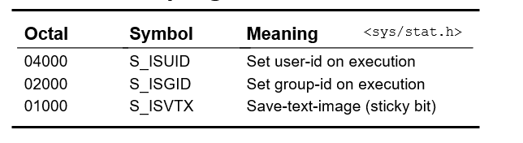
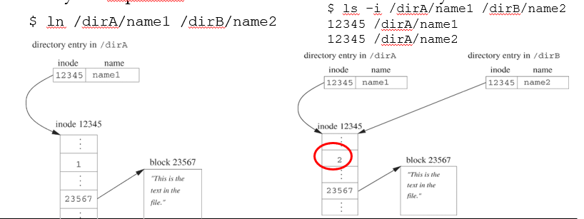
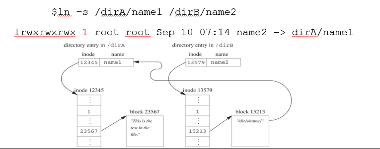

# Ch03 The File in context

## 3.1 다중 사용자 환경에서의 화일

### 3.1.1 사용자와 소유권

유닉스 운영체제는 여러 사람이 사용할 수 있는 다중 사용자 환경이다. 각 사용자는 사용자 식별번호(user-id, uid)로 식별될 수 있으며, 유닉스의 특정파일(/etc/password)에 사용자 식별번호들을 관리하고 있다.

유닉스에서는 그룹이라는 정보도 관리한다. 사용자는 특정한 그룹에 속할 수 있다. 특정 그룹에는 특별한 명령을 수행할 수 있는 권한이나, 특정 파일에 접근할 수 있는 권한이 부여될 수 있다. 이러한 그룹은 그룹 식별번호(group-id, gid)로 식별될 수 있으며, 역시 유닉스 특정파일(/etc/password)에 그룹 식별번호들을 관리하고 있다.

유닉스에서 실행되는 프로세스는 해당 프로세스를 실행시킨 사용자(user)와 밀접한 관계를 갖는다. 프로세스에는 user_id, group_id가 설정되는데, 해당 프로세스를 실행시킨 사용자의 user_id와 group_id가 설정된다.

유닉스에서 화일은 여러 사람에 의해서 접근될 수 있다. 파일은 해당 파일을 생성한 사용자에 의해서 '소유'되는 관계가 형성된다. 파일을 생성한 사용자는 해당 파일을 생성한 프로세스의 user_id로 식별하게 된다(실제로는 프로세스의 effective user_id 로 설정된다). 파일의 '소유자'는 파일에 대해서 특별한 권한이 부여된다. 파일 소유자는 파일에 대한 허가(permission)을 변경하거나, 파일 소유자를 변경할 수 있는 권한을 가지게 된다.



앞서 effective user_id, euid 에 대해서 잠깐 언급하였다. 파일을 생성할 때 해당 파일에 대한 소유자 정보는 실제로는 euid로 설정이 된다. 프로세스를 실제로 실행시킨 사용자 정보를 real user_id(ruid)라고 한다. 보통은 ruid와 euid가 동일하다. 그러나 특수한 경우에 ruid와 euid가 다르게 설정될 수 있다. 이에 대해서는 후에 알아보자.

### 3.1.2 허가와 화일 모드



파일에 대한 허가(permission)란 어떤 사용자가 파일을 읽거나(read), 파일에 내용을 쓰거나(write), 파일이 실행 가능한 정보를 담고 있다면 해당 파일을 실행(execute)할 수 있는지 여부를 뜻한다. 이러한 허가(permission)은 보통 `open`이나 `creat` 시스템 호출을 할때 인자로 전달한 `mode_t mode`(화일 모드)를 통해서 설정된다.

화일 모드를 나타내는 인자 `mode`의 하위 9 bit에는 화일에 대한 permission이 설정된다. 맨 처음 3bit는 해당 파일 소유자에 대한 permission, 그 뒤 3 bit는 파일 소유자가 속한 그룹에 대한 permission, 마지막 3 bit는 그 외의 사용자에 대한 permission이 설정된다. 각각의 3 bit는 순서대로 파일에 대한 읽기, 쓰기, 실행 허가를 나타낸다. 해당 자리의 bit가 1로 셋팅 되어있으면 그와 연관된 동작을 수행할 수 있다.

`mode`파일을 설정할 때는 보통 8진수 정수 형태로 설정하는 것이 대부분이다. 파일 permission과 관련된 상수들이 정의되어 있지만 잘 사용하지 않는다.

### 3.1.3 수행 가능한 화일에 대한 그 밖의 허가

파일에 대해서 읽기, 쓰기, 실행 허가(permission) 이외에 set-user-id on execution, set-group-id on execution의  추가적인 허가(permission)가 존재한다. 이러한 허가가 설정되어 있으면 파일이 실행가능한 파일인 경우 해당 파일이 실행될 때 effective user id가 파일의 소유자로 설정이 된다. 따라서 effectvie user_id(euid)는 프로세스를 실행시킨 실제 user_id (ruid)와 달라질 수 있다. 이같은 동작은 보안에 민감한 파일들에 대해서 제한적인 접근을 제공하는 인터페이스 구축에 사용될 수 있다.



예를 들어서 보안에 민감한 파일(파일 a라고 하자)을 소유하고 있는 사용자1은 다른 사용자들이 함부로 파일 a에 대해서 접근하지 못하도록 하고싶다. 아예 접근을 막는것이 가장 효과적이겠지만 현실상 다른 사용자들도 일부 파일 a를 접근해야 한다고 해보자. 이 때 파일 a에 대한 다른 사용자의 접근은 막고, 파일 a의 일부분에만 접근을 할 수 있는 프로그램을 생성하여 이 프로그램의 set user_id permission을 셋팅한다. 다른 사용자들이 이 프로그램을 실행시키면, 해당 프로세스의 effective user_id는 사용자1의 id로 설정이 되기 때문에 이 프로세스를 통해서 다른 사용자들이 파일 a에 제한적으로 접근할 수 있다.

별로 효용성은 없지만 effective group_id라는 것도 존재하여 위와 비슷한 효과를 낸다. 또한 sticky_bit라는 것도 있는데 생략한다.

이들 permission은 `mode_t mode` 일반적인 file permission 앞 쪽 3 bit에 설정된다.

또한 다음 쉘 스크립트를 통해서 set-user-id 비트를 설정할 수 있다.

```bash
$ chmod u+s filename
```

### 3.1.4 화일 생성 마스크와 umask 시스템 호출

앞서 파일에 대한 허가(permission)은 파일을 open이나 creat할 때 `mode` 인자를 전달하면서 설정한다고 하였다. 이 때 mode에 전달한 permission이 그대로 설정되지는 않는다. 유닉스 커널에서는 필요없는 permission이 설정되는 것을 방지하기 위해서 파일 생성 마스크(file creation mask)라는 것을 관리한다. 프로세스에서 open 시스템콜로 전달되는 허가는 사실상 file creation mask값의 1의 보수 값과 비트 and 연산된 값이 들어가게 된다.

```c
open("filename", O_WRONLY | O_CREAT, mode);
// 위 문장은 사실상 아래와 같다.
open("filename", O_WRONLY | O_CREAT, ~(mask) & mode);
```

이러한 파일 생성 마스크 값은 umask 시스템 호출을 통해서 설정할 수 있다.

```c
mode_t umask(mode_t cmask);
```

인자로 전달한 8진수 값으로 mask 값이 설정되며, 반환값은 이전의 mask 값이다. 만약 호출에 실패하게 되면 -1을 반환하게 된다.

### 3.1.5 open과 화일 허가

프로세스가 파일을 open 하려고 할 때, 프로세스에 설정된 effective user_id, effective group_id에 따라서 open 시스템콜 성공 여부가 결정된다. 이 때 effective user_id와 파일 소유자가 동일하면 이에 대한 허가(permission)만 고려된다. group_id도 동일하다고 하여도, 앞에서 user_id가 동일하면 뒤의 permission은 고려되지 않는다.

### 3.1.6 access 호출로 화일 접근 가능성 결정

access 시스템 호출은 프로세스가 특정 파일에 대한 접근 가능성 여부를 판단하는 호출이다.

```c
int access(const char * filename, int amode);
```

이 시스템 호출의 2번째 인자에는 특정한 접근 동작을 나타내는 상수가 전달된다.

- R_OK : 읽기 가능 여부를 판단할때 전달한다.
- W_OK : 쓰기 가능 여부를 판단할때 전달한다.
- X_OK : 실행 가능 여부를 판단할때 전달한다.

만약 해당 permission이 존재하지 않다면 -1을 반환한다.

### 3.1.7 chmod로 화일 허가 변경

파일에 부여된 허가(permission)은 chmod 시스템 콜을 통해서 변경할 수 있다. 다만 변경은 슈퍼유저라 불리는 관리자나 파일을 소유한 사용자만이 가능하다.

```c
int chmod(const char * filename, mode_t newmode);
```

### 3.1.8 chown으로 소유권 변경

파일의 소유자는 chown 명령어를 통해서 변경할 수 있다. chown 명령어 또한 슈퍼유저나 파일의 소유자만이 호출할 수 있다. 파일의 소유자가 변경될 때는 실행 가능 파일에 대한 set effective user_id, set effective group_id permission이 해제된다. 이는 악의적인 사용자가 보안이 필요한 다른 사용자의 파일 정보를 획득하는 행위를 제한한다.

```c
int chown(const char * pathname, uid_t owner_id, gid_t group_id);
```

## 3.2 다수의 이름을 갖는 화일

### File System

File System은 저장장치에 저장된 파일에 대한 구조적이고 효과적인 접근을 가능케하는 시스템이다. 유닉스 File system은 디렉토리를 통해서 파일들을 관리한다. 디렉토리는 hierarchical한 구조를 나타낸다. 가장 위쪽 루트쪽에는 루트 디렉토리(/)가 존재한다.

유닉스에서 파일의 이름은 디렉토리에 저장된다. 디렉토리는 파일에 대한 이름과 이 파일에 대응하는 inode 에 대한 번호를 저장하는 table 형태로 되어있다. 이러한 형태로 되어있는 파일 이름을 hard link라고 한다. 해당 파일에 대한 inode 구조에는 파일에 대한 hard link count 값이 관리된다.

### 3.2.1 시스템 호출 link

시스템 호출 link는 인자로 전달한 파일에 대해서 새로운 파일이름을 생성한다.

```c
int link(const char * orgfilename, const char * newfilename);
```

파일 이름이 생성되는 위치는 동일 디렉토리일 필요가 없다. 파일에 대한 link 호출은 해당 파일의 inode 구조에 link count 값을 증가시킨다. 이 파일에 대해서 어느 이름이던지 간에 open, read, write는 동일한 파일에 대해서 수행된다.



또한 쉘 스립트에서도 위와 같은 형태로 ln이나 link 명령어를 통해서 새로운 hard link를 생성할 수 있다.

### 3.2.2 시스템 호출 unlink의 재검토

시스템 호출 unlink는 파일에 대한 hard link를 제거한다. 파일 이름을 제거하면 해당 파일에 대한 inode 구조에서 link count 값이 1 줄어들게 된다. link count 값이 0이 되고, 해당 파일을 open한 프로세스가 존재하지 않으면 해당 파일은 파일 시스템에서 제거되고, 복구할 수 없게 된다.

unlink는 해당 File에 대한 write 권한이 있어야 가능하며, 디렉토리의 리스트를 제거할 수 있기 때문에 해당 디렉토리에 대한 write 권한도 있어야 가능하다.

#### remove

remove 라이브러리 루틴은 unlink 시스템 호출과 정확히 같은 동작을 수행한다.

### 3.2.3 rename 시스템 호출

```c
int rename(const char * oldname, const char * newname);
```

oldname을 newname으로 바꾼다. 이 때 newname 이름으로 파일이 이미 존재하면, 해당 파일을 제거하고 새로운 파일이름을 생성한다.

### 3.2.4 심볼형 링크

파일에 대한 hard link는 원본 파일이 저장되어 있는 동일한 파일 시스템에서만 사용할 수 있다. 이러한 한계를 극복하기 위해서 심볼형 링크(symbolic link)가 등장하였다.

심볼릭 링크는 하드 링크와는 다르게 실제로 존재하는 파일이다. 그러나 이 파일에 들어있는 정보는 원본 파일 이름에 대한 정확한 경로 정보이다. 심볼릭 링크는 동일 파일 시스템에 대한 파일 뿐만 아니라, 다른 파일 시스템에 존재하는 파일에 대해서도 생성할 수 있다. 프로세스나 사용자가 심볼릭 링크 파일을 읽게되면 심볼릭 링크 파일이 읽혀지는 것이 아니라, 심볼릭 링크 파일이 가리키고 있는 파일이 읽혀진다. 심볼릭 링크는 원본 파일에 대한 포인터로 해석할 수 있다.



심볼릭 링크는 simlink라는 시스템 호출로 생성할 수 있다.

```c
int simlink(const char * orgfilename, const char * symfilename);
```

또한 쉘에서 ln 명령어에 -s 옵션을 주어 심볼릭 링크를 생성할 수도 있다.

```bash
$ ln -s a b
```

앞서 심볼릭 링크 파일을 읽게되면 원본 파일이 읽혀진다고 하였다. 또한 특정 프로세스가 open이나 read 시스템 호출을 통해서 심볼릭 링크 파일을 접근하면 원본 파일에 대해서 접근하게 된다. 심볼릭 링크 파일 자체에 접근하기 위해서는 특수한 시스템 콜을 호출해야 한다.

```c
int readlink(const char * symfilename, char * buf, ssize_t bufsize);
```

심볼릭 링크 파일에 있는 정보는 원본 파일의 경로라서 비교적 간단하기 때문에 따로 open이나 close 호출없이 simread 호출로 open read close 동작이 한번에 이루어진다.

원본 파일이 제거되더라도 심볼릭 링크 파일은 그대로 남아있게 된다. 심볼릭 링크 파일의 경로 이름도 그대로 남아있게 된다. 그러나 심볼릭 링크 파일을 open 하거나 read 할 경우 에러가 발생하게 된다.

## 3.3 화일 정보의 획득 : stat와 fstat

다음 시스템 호출은 파일에 대한 정보를 확인할 수 있는 시스템 호출이다.

```c
int stat(const char * pathname, struct stat * buf);
int fstat(int filedes, struct stat * buf);
// 심볼릭 링크 파일 정보를 얻기 위한 시스템 호출
int lstat(const char * pathname, struct stat * buf);
```

두번째 인자는 파일의 정보를 저장할 struct stat 타입 변수의 포인터이다. 위 두 시스템 호출이 성공적으로 수행되면 인자로 전달한 status 변수에는 파일에 대한 다양한 정보를 포함하게 된다.

- mode_t st_mode : 파일의 타입 및 허가(permission)
- ino_t st_ino : 해당 파일의 inode 번호
- dev_t st_dev : 해당 파일이 저장되어 있는 파일 시스템의 장치 번호
- dev_t st_rdev : 장치 파일의 경우 해당 장치의 장치번호
- nlint_t st_nlink : link count
- uid_t st_uid : 소유자 id
- gid_t st_gid : 소유자의 group id
- off_t st_size : 파일의 사이즈(regular file)
- time_t ctime : 파일 status 값이 수정된 시간
- time_t mtime : 파일이 마지막으로 수정된 시간
- time_t atime : 파일이 마지막으로 접근된 시간
- blksize_t st_blksize : best i/o block size
- blkcnt_t st_blocks : 할당된 디스크 블록 개수

### 3.3.1 chmod의 재고
