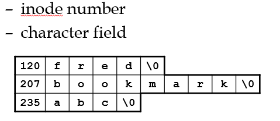
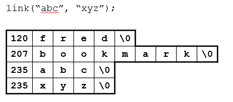
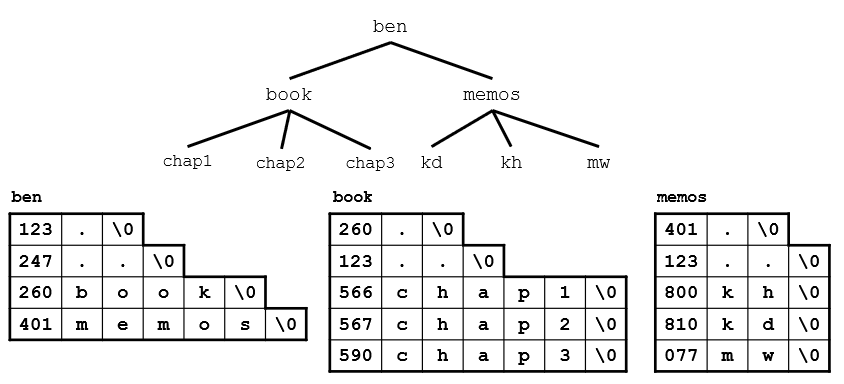
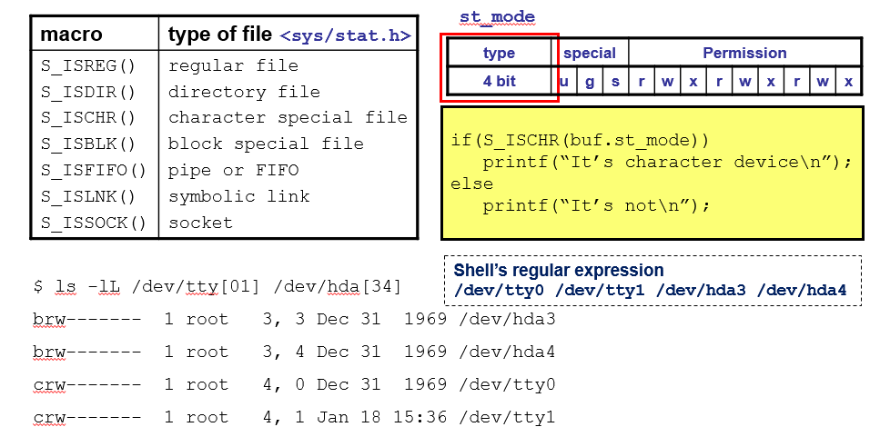

# Ch04 Directory FileSystem SpecialFile

## 4.1 서론

UNIX 의 디렉토리는 저장장치에 저장되어 있는 파일들에 대한 계층적 구조를 형성한다. 파일들에 대한 계층적 구조는 디렉토리와 서브 디렉토리 구조를 통해서 구현된다. 파일들은 특정 디렉토리에 포함되며 디렉토리들은 트리 구조를 그리며 서로를 포함한다. 이 트리 구조의 맨 꼭대기에는 '/'로 표시되는 루트 디렉토리가 존재한다.

UNIX 파일 시스템은 전체 파일과 디렉토리의 모임으로서 UNIX 파일 구조를 구성하는 디렉토리와 화들의 계층적인 트리 구조의 완전한 한 부분을 나타낸다. 디스크 메모리를 관리하는 일종의 소프트웨어이다. 파티션 또는 디스크 전체에 대응된다.

특수 화일 : UNIX는 일반 정규 파일뿐만 아니라, 주변 장치 및 주기억 장치조차도 바이트 스트림을 저장하고 있는 파일로 간주한다. 이러한 장치들에도 식별할 수 있는 파일 이름이 부여되며 open, read, write와 같은 시스템 콜도 호출 가능하다. 이 같은 시스템 콜은 장치와 연관된 device driver 코드를 실행시킨다. 그러나 어떻게 device driver가 구현되는지는 알 필요가 없으며, 사용자는 정규파일이든 장치든 상관 없이 동일한 방식으로 취급할 수 있게된다.

## 4.2 디렉토리 : 사용자 관점

사용자 입장에서 디렉토리는 파일들을 그룹화하여 관리하는 도구를 제공한다. 또한 계층적인 트리 구조를 구성할 수 있도록 서브 디렉토리, 즉 한 디렉토리가 다른 디렉토리를 계층적으로 포함시킬 수 있다.

로그한한 사용자는 현재 작업 디렉토리 또는 현재 디렉토리라는 화일 구조의 한 특정한 장소에서 작업을 하게 된다. 현재 작업 디렉토리는 cd 명령어를 통해서 변경할 수 있다. 또한 현재 작업 디렉토리는 pwd 라는 명령어를 통해서 확인할 수 있다. 그리고 현재 디렉토리는 시스템에 있어서 파일의 상대경로를 찾기 위한 기준이 된다.

## 4.3 디렉토리의 구현

디렉토리 또한 하나의 파일이다. 그래서 소유자, 그룹 소유자, 크기, 접근 허가 등을 갖는다. 또한 open, read, lseek, fstat, close 등의 시스템 호출을 사용할 수 도 있다(권장되지 않는다). 그러나 디렉토리는 creat이나 open 등의 시스템 호출로 만들어 질 수 없으며, write 함수를 통해서 쓰여질 수 없다.

디렉토리 파일에는 디렉토리가 포함하고 있는 파일들 또는 부디렉토리의 이름과 그 파일들에 대한 inode 번호가 담긴 엔트리들을 관리하고 있다.

inode 번호는 inode 구조라 불리는 디스크 기반의 자료구조를 찾기 위해 운형체제에 의해 사용된다. 이 inode 구조에는 파일에 대한 모든 정보, 허가, 소유자, 파일 크기, 디스크 내에서 저장된 블록의 위치 등 이 저장되어 있다.



### 4.3.1 link와 unlink의 재고찰

앞선 장에서 link와 unlink를 통해서 파일에 대한 hard link를 생성하고 지우는 방법을 알아보았다. link 시스템 호출은 디렉토리에 저장되어 있던 원래 파일과 동일한 inode 번호를 같은 새로운 디렉토리 엔트리를 추가한다.



이들 시스템 호출은 hard link를 디렉토리 엔트리에 추가하고, 제거하는 시스템 호출이라고 할 수 있다. 따라서 디렉토리 파일에 대한 write permission이 있는 프로세스만이 해당 경로에 hard link를 생성하거나 제거할 수 있다.

### 4.3.2 점과 이중점

디렉토리 파일 내에는 특별한 파일에 대한 엔트리가 기본적으로 들어있다. 점(.)으로 표시되는 파일에 대한 엔트리는 현재 디렉토리 파일에 대한 엔트리를 나타낸다. 이중점(..)으로 표시되는 파일에 대한 엔트리는 디렉토리 계층 구조상 현재 디렉토리의 부모 디렉토리 파일(현재 디렉토리를 포함하는 디렉토리)에 대한 엔트리를 나타낸다.



### 4.3.3 디렉토리 허가

디렉토리도 하나의 파일이기 때문이 파일에 대한 permission이 존재한다. 또한 정규 파일의 permission이 구성되는 방식과 동일하게 구성된다. 그러나 이 permission은 일반 파일과는 의미가 다르다.

- read permission : 디렉토리 파일 내에 있는 엔트리들을 리스트 할 수 있는지 여부이다. 쉘 프로그램에서는 ls 명령어들 통해서 디렉토리 내의 파일들을 확인할 수 있는지에 대한 여부를 뜻한다.
- write permission : 디렉토리에 새로운 파일을 추가하거나, 제거할 수 있는지 여부를 뜻한다.
- execute permission : 프로세스에서 해당 디렉토리를 현재 작업 디렉토리로 설정할 수 있는지 여부이다. 디렉토리 내의 파일을 열거나 접근하기 위해서는 이 권한이 필요하다(먼저 그 파일이 들어있는 디렉토리로 이동 및 search 해야 하기 때문이다). 쉘 프로그램이 현재 작업디렉토리를 특정 디렉토리로 설정하기 위해서는 화일의 절대 경로 이름에 명세된 각 디렉토리에 대해 execute permission이 있어야한다.

## 4.4 디렉토리와 프로그래밍

디렉토리에 관련한 몇가지 시스템 호출이 있다. 이들 시스템 호출은 대부분 <dirent.h>에 저장되어있는 dirent 자료구조를 대상으로 할 때가 많다.

```c
struct dirent {
    ino_t d_ino;      /* inode 번호 */
    char d_name[];    /* null로 끝나는 화일이름 */
}
```

### 4.4.1 디렉토리의 생성 및 제거

디렉토리는 mkdir 시스템 호출로 생성할 수 있다.

```c
#include <sys/types.h>
#include <sys/stat.h>

int mkdir(const char * pathname, mode_t mode);
```

역시 디렉토리를 생성하는 프로세스는 생성된 디렉토리가 저장될 부모 디렉토리에 대한 write permission이 존재해야 한다. 또한 이 디렉토리에 .과 ..에 해당하는 디렉토리 엔트리를 자동으로 채워넣는다.

디렉토리가 더이상 사용될 필요가 없으면 rmdir 시스템 호출로 제거할 수 있다.

```c
#include <unistd.h>

int rmdir(const char * pathname);
```

이 호출은 디렉토리가 비어있을 경우에만 성공한다.

### 4.4.2 디렉토리를 열기 및 닫기

디렉토리 역시 파일이기 때문에 파일에 대한 open, read, write 호출이 가능하지만 권장되지 않는다. 디렉토리 파일을 열고 닫기 위해서는 특별한 시스템 호출을 사용하는 것이 권장된다.

UNIX 디렉토리를 개방하기 위해서 opendir 시스템 호출을 사용할 수 있다.

```c
#include <sys/types.h>
#include <dirent.h>

DIR* opendir(const char * dirname);
```

이 시스템 호출은 디렉토리 파일에 대한 경로 이름을 전달 받고, DIR 구조체 포인터를 반환한다. 이는 파일을 여는 표준 라이브러리 루틴 `fopen()`이 파일 구조체 포인터를 반환하는 것과 비슷하다. 커널은 디렉토리에 대한 스트림을 형성하고, 이 스트림에 대한 접근을 DIR 구조체 포인터를 통해서 할 수 있다.

열려진 디렉토리 파일을 닫기 위해서는 closedir 시스템호출을 사용할 수 있다.

```c
#include <sys/types.h>
#include <dirent.h>

int closedir(DIR* dirptr);
```

### 4.4.3 디렉토리를 읽기 : readdir과 rewinddir

디렉토리가 일단 개방되면 각 디렉토리 엔트리는 dirent 구조로 읽혀질 수 있다.

```c
struct dirent* readdir(DIR* dirptr);
```

dirptr은 읽어들일 디렉토리에 대한 DIR 구조 포인터이다. readdir에 대한 첫 호출에 의해 디렉토리의 첫 항이 struct dirent로 읽혀 들여질 것이다. 호출이 끝나면, 디렉토리 포인터는 디렉토리의 다음 항으로 이동해 있을 것이다. 모든 디렉토리 엔트리가 읽혀지면 readdir은 널포인터를 반환할 것이다.

다시 처음의 디렉토리 엔트리부터 읽어들이기 위해서 `rewinddir` 시스템 호출을 사용할 수 있다.

```c
void rewinddir(DIR* dirptr);
```

### 4.4.4 현재 작업 디렉토리

쉘 프로그램을 보면 $기호 앞에 현재 쉘 명령어가 적용될 디렉토리를 보여준다. 쉘 프로그램에서 실행 파일을 입력하거나, 명령어를 입력하면 기본적으로 쉘 프로그램이 실행되고 있는 위치를 기반으로 실행된다. 이러한 디렉토리 경로를 현재 작업 디렉토리(current working directory, cwd)라고 한다. cwd는 또한 상대적 경로를 계산하는 기준을 제공한다. 점(.) 기호는 현재 작업 디렉토리를 나타내며, 이중점(..)은 현재 작업 디렉토리의 부모 디렉토리를 나타내게 된다.

쉘 프로그램 뿐만 아니라 실행되는 모든 프로세스는 자신만의 cwd를 가지게 된다. 프로세스의 최초 cwd는 자신이 시작된 프로세스의 cwd로 설정된다. cwd를 통해서 파일에 접근하는 상대 경로, 시스템 호출을 적용하는 경로를 계산하게 된다.

### 4.4.5 chdir에 의한 디렉토리 변경

프로세스의 현재 작업 디렉토리를 변경하기 위해서는 `chdir` 시스템 호출을 사용할 수 있다.

```c
int chdir(const char * pathname);
```

chdir 명령어를 통해서 현재 작업 디렉토리를 변경하기 위해서는 변경된 작업디렉토리의 경로상에 존재하는 모든 디렉토리에 대한 execute permission을 가지고 있어야 한다.

### 4.4.6 현재 작업 디렉토리의 이름 찾기

현재 프로세스가 수행되고 있는 디렉토리의 이름은 다음 시스템 호출로 구할 수 있다.

```c
char* getcwd(char * name, size_t size);
```

### 4.4.7 디렉토리 트리의 산책

## 4.5 UNIX 화일 시스템

- 부트 블록(Boot block) : 파티션의 맨 앞쪽의 블록. UNIX 시스템을 시작하는 코드가 담겨있다. 맨 처음 컴퓨터를 부팅할 경우 이 블록에 저장되어 있는 코드가 로드되어 실행된다.
- 수퍼 블록(Super Block) : 파일 시스템에 대한 전반적인 정보가 저장되는 블록이다. 이 블록에는 전체 블록 사이즈, inode 블록 개수, free inode 번호 리스트에 대한 포인터, free block 번호 리스트에 대한 포인터, 데이터 저장 블록 개수 등등의 정보가 담긴다.
- inode 블록 : 파일에 대한 inode 구조를 위해 만들어진 블록이다. 하나의 파일은 하나의 inode와 대응한다. 이 inode 구조에는 해당 파일에 대한 link count나 파일이 저장되어 있는 disk 블록의 위치 등을 저장하고 있다.
- data block : 일반 파일들이 실제로 저장되는 위치이다.

### 4.5.1 캐슁 : sync와 fsync

UNIX에서는 파일에 대한 I/O를 곧바로 디스크에 수행하지 않고 UNIX 운영체제가 관리하는 메모리 버퍼에 임시로 저장해둘 수 있다. 따라서 프로그램 수행의 한 시점에서 디스크 파일에 저장되어 있는 내용과 프로세스에서 출력했던 내용이 일치하지 않을 수 있다. 현재 파일로 출력했던 내용을 곧바로 디스크에 쓰기 위해서는 다음 시스템 호출을 이용할 수 있다.

```c
int sync();
int fsync(int filedes);
```

fsync 함수는 인자로 넘겨준 파일이 모두 디스크에 쓰이기 전에는 리턴하지 않는다. 그러나 sync() 함수는 데이터가 모두 디스크에 쓰이기 전에 바로 리턴한다.

## 4.6 UNIX 장치 화일

UNIX PC의 주변장치(프린터, 콘솔, 모니터, 디스크) 등은 각각을 식별하는 장치번호(Major Device number)가 부여되어 있다. 또한 한 장치의 여러 instance는 minor device number로 식별할 수 있다. 그러나 사용자는 각 장치를 일반 파일과 동일하게 취급할 수 있다. UNIX에서는 각 장치에도 파일이름을 부여하기 때문이다. 이를 장치 파일이라고 한다. 사용자가 장치 파일 이름을 이용해서 일반 파일과 동일하게 접근하게 하도록 장치 파일에 대한 inode 구조에는 해당 장치의 major number와 minor number 정보들이 포함되어 있다.

### 4.6.1 블록과 문자 장치 화일

블록 디바이스 파일 : 디스크나 자기 테이프의 경우 데이터 입출력이 블록단위로 진행하고, random access가 가능하다.

문자 디바이스 파일 : 터미널, 모뎀, 프린터와 같이 입출력이 임의의 바이트 단위로 수행되는 장치이다. random access는 가능할 수도 있고, 불가능할 수도 있다.

### 4.6.2 stat 구조의 재고찰

stat 시스템 호출을 통해 얻은 stat 구조체 정보에서 st_mode 필드의 상위 4비트는 이 장치가 블록 디바이스 파일인지 문자 디바이스 파일인지를 구분할 수 있게 해준다.



### 4.6.3 화일 시스템 정보

### 4.6.4 화일과 디렉토리의 제한: pathconf와 fpathconf
