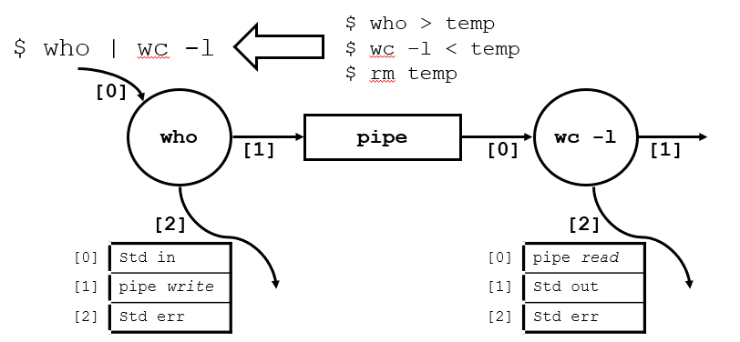

# Ch07 파이프를 이용한 프로세스간 통신

때로는 여러 프로세스가 서로 협력하여 일을 처리할 필요가 있을 수 있다. 이 경우 프로세스간에 정보나 데이터를 주고 받기 위한 수단이 필요해진다. 6장에서 배운 시그널은 비정상적인 상황을 표현하기 위해서 주로 사용되기 때문에, 데이터를 주고받는 용도로 사용하기는 적절하지 않다. 또다른 방법으로 한 파일에 대해서 여러 프로세스가 동시에 읽기와 쓰기를 수행하게 할 수 있다. 그러나 이 경우에 파일에 대한 경쟁이 생기고, 프로세스 간의 동기화를 설정할 필요가 있다.

이러한 문제를 해결하기 위해서 **파이프(Pipe)** 가 고안되었다. 특정한 하나의 임무를 수행하는 프로세스를 생성하고, 프로세스가 그 일을 잘 수행하도록 분리하는 것, 그리고 이런 프로세스들이 서로 협력하여 다양한 작업이 가능하도록 이들간의 공통 인터페이스를 제공하는 것이 파이프의 철학이다.


## 7.1 파이프

### 7.1.1 명령 수준에서의 파이프

쉘 프로그램에서 파이프는 파이프 기호(|)를 통해서 표시된다.

```bash
$ who | wc -l
```

위 명령에서 파이프 기호(|)의 의미는 who 프로그램의 표준 출력을 wc 프로그램의 표준 입력에 연결하라는 것이다. 이에 따라서 who 프로그램의 출력 결과가 wc 의 입력으로 들어가서 wc는 이 출력 결과의 라인수를 쉘에 나타내게 된다.



### 7.1.2 파이프를 이용한 프로그래밍

프로그래밍 레벨에서 파이프를 사용하기 위해서는 우선 pipe를 생성해야 한다. pipe 시스템 호출로 생성할 수 있다.

```c
#include <unistd.h>

int pipe(int filedes[2]);
```

- int filedes[2] : 파이프가 생성되면 파이프에 데이터를 전달받는 입구를 나타내는 파일 기술자를 filedes[0]에, 파이프에서 데이터를 전달하는 입구를 나타내는 파일 기술자를 filedes[1]에 설정한다.
- 반환값
  - 0 : 성공
  - -1 : 실패. 프로세스가 open 할 수 있는 파일의 개수 제한을 초과할 경우 EMFILE, 시스템 전체에서 open 할 수 있는 파일 개수 제한을 초과할 경우 ENFILE 값이 errno에 설정된다.

pipe() 호출을 통해서 파이프를 생성하면 일반 파일에서 데이터를 입출력 하듯이 pipe를 나타내는 file descriptor를 통해서 데이터를 입출력 할 수 있다. pipe는 프로세스간의 **half duplex 통신 채널** 을 제공한다.

> 예제

```c
#include <unistd.h>
#include <stdio.h>
#include <stdlib.h>
#include <string.h>
#define BUF_SIZE 100
const char * msg1 = "hello world! #1";
const char * msg2 = "hello world! #2";
const char * msg3 = "hello world! #3";

int main() {

    int filedes[2];
    int i;
    char buffer[BUF_SIZE];

    if (pipe(filedes) < 0) {
        perror("pipe()");
        exit(1);
    }

    write(filedes[1], msg1, strlen(msg1) + 1);
    write(filedes[1], msg2, strlen(msg2) + 1);
    write(filedes[1], msg3, strlen(msg3) + 1);

    for (i = 0; i < 3; i++) {
        read(filedes[0], buffer, BUF_SIZE);
        printf("%s\n", buffer);
    }

    return 0;
}
```

pipe에 데이터를 읽고 쓰는 경우, 데이터는 pipe의 buffer에서 선입선출(FIFO) 방식으로 처리된다. pipe에 대해서 lseek는 동작하지 않기 때문에 이 순서는 변경될 수 없다.

위 예제는 한 프로세스가 파이프를 통해서 메시지를 보내고, 또 스스로 보낸 메시지를 받는다. 이런 프로그램은 거의 작성하지 않는다. 파이프를 제대로 사용하기 위해서는 fork() 시스템 호출을 통해서 다른 프로세스와 통신을 할때 진가가 나타난다.

> 예제 2

```c
#include <unistd.h>
#include <stdio.h>
#include <stdlib.h>
#include <sys/wait.h>
#include <sys/types.h>
#define MSGSIZE 16

char *msg1 = "hello, world #1";
char *msg2 = "hello, world #2";

int main()
{
    char inbuf[MSGSIZE];
    int p[2], j;
    pid_t pid;

    /* 파이프를 개방한다. */
    if (pipe(p) == -1) {
        perror("pipe call error");
        exit(1);
    }

    pid = fork();
    if (pid == 0) { // 자식 프로세스
        close(p[0]);
        write(p[1], msg1, MSGSIZE);
        return 0;
    }

    pid = fork();
    if (pid == 0) { // 자식 프로세스
        close(p[0]);
        write(p[1], msg2, MSGSIZE);
        return 0;
    }

    // 부모 프로세스
    close(p[1]);
    for (j = 0; j < 2; j++) {
        read(p[0], inbuf, MSGSIZE);
        printf("%s\n", inbuf);
    }
    wait(NULL);
    wait(NULL);
    return 0;
}
```

위 예제에서 설명해야하는 것이 또 있다. 파이프는 프로세스간 half duplex 통신 채널을 제공한다고 하였다. 그러나 여러 프로세스가 pipe에 대해서 write와 read를 동시에 호출하는 경우 혼란의 여지가 있다. 따라서 프로세스는 한 pipe에 대해서 read 또는 write 중 하나만을 사용하여 이러한 혼란을 줄여야 한다. 위 예제에서는 혼란을 줄이기 위해서 사용하지 않는 file descriptor를 close 한다.

사용하지 않는 pipe 관련 file descriptor를 close하지 않은 경우에 발생할 수 있는 문제를 다음 예제에서 나타낸다.

```c
...
char *msg1 = "hello, world #1";
char *msg2 = "hello, world #2";
char *msg3 = "hello, world #3";

main() {
    char inbuf[MSGSIZE];
    int p[2];
    pid_t pid;
    pipe(p);

    switch(pid = fork()) {
    case -1: perror("fork call");
        exit(2);
    case 0:
        write(p[1], msg1, MSGSIZE);
        write(p[1], msg2, MSGSIZE);
        write(p[1], msg3, MSGSIZE);
        break;
    default:
        for (j = 0; j < 3; j++) {
            read(p[0], inbuf, MSGSIZE);
            printf("%s\n", inbuf);
        }
        wait(NULL);
    }
    return 0;
}
```

위 예제는 fork를 이용해서 자식 프로세스를 생성한 뒤 부모프로세스에게 3개의 메시지를 보내도록 하고, 부모 프로세스는 이 메세지들을 받아서 화면에 출력한다. 이때, j를 이용해서 수행되는 for문이 `j < 4` 조건으로 바뀌면 어떻게 될까? 마지막 반복에서 파이프 버퍼에 남아있는 데이터가 없기 때문에 read()는 blocking 되고 영영 종료하지 못한다. read()가 blocking 되는 이유는 파이프에 데이터를 전달하는 입구에 대한 filedescriptor (p[1])이 아직 close 되지 않았기 때문이다. 이와 같은 문제를 방지하기 위해서는 반드시 사용하지 않는 filedescriptor를 close 해주어야 한다.

### 7.1.3 파이프의 크기

파이프에 데이터를 쓸 수 있는 양은 내부 버퍼 크기로 제한된다. POSIX 표준 파이프 버퍼 크기는 512 Bytes이다. 그러나 대부분의 유닉스 구현들은 이보다 큰 크기의 파이프 버퍼를 가지고 있다.

write 시스템 호출은 원자적으로 실행된다. 파이프의 버퍼 내부의 빈공간이 write를 통해 쓸 데이터 크기보다 크다면 write 시스템 호출은 모든 데이터를 하나의 원자적 커널 연산으로 수행된다. 버퍼가 꽉 차있다면 write는 빈공간이 생길때까지 blocking 된다.

버퍼에 빈공간이 있지만 모든 데이터를 쓰기에는 적은 공간이라면 write 호출은 일단 버퍼에 쓸 수 있을 만큼 데이터를 쓰고 난 뒤, 남은 데이터를 쓸 공간이 생길때까지 blocking된다. 이는 write 호출이 여러 단계로 수행됨을 의미한다. 만약 여러 프로세스가 동시에 이같은 동작을 수행한다면 데이터의 순서가 엉망이 될 수 있으므로 주의해야한다.

### 7.1.4 파이프를 통한 read, write 호출의 동작

파이프를 통해서 read, write를 호출하는 경우 다음과 같이 동작한다.

- read
  - pipe buffer에 데이터가 존재하는 경우 : read() 호출이 끝나고 곧바도 리턴
  - pipe buffer에 읽어들일 데이터가 없는 경우 : 다른 곳에서 write()를 통해서 데이터를 전달할 때까지 blocking
- write
  - pipe buffer에 데이터를 쓸 공간이 남아있는 경우 : buffer에 데이터를 쓰고 바로 리턴
  - pipe buffer에 데이터를 쓸 공간이 없는 경우 : 다른 곳에서 read()하여 buffer에 빈공간이 생길 때까지 blocking

만약 파이프의 입구 또는 출구 중 하나가 close 된 상황에서 read, write를 호출하는 경우에는 다음과 같이 동작한다.

- read : 곧바로 0을 반환한다. 이는 더이상 읽어들일 데이터가 존재하지 않는 EOF 상태를 나타낸다.
- write : SIGPIPE 시그널이 발생한다. 이 시그널에 대한 디폴트 액션은 프로세스 종료이다. 만약 이 시그널을 무시하거나, catch하여 시그널 핸들러를 실행시키면 write 호출은 -1을 반환하고, errno에는 EPIPE 값이 설정된다.

### 7.1.5 blocking 되지 않는 read(), write() 호출

만약 read, write 호출시 blocking 되지 않게 하고 싶다면 `fcntl` 시스템 호출을 이용할 수 있다.

```c
#include <unistd.h>
#include <fcntl.h>

int main() {
    int filedes[2];
    pipe(filedes);

    fcntl(filedes[0], F_SETFL, O_NONBLOCK);
    fcntl(filedes[1], F_SETFL, O_NONBLOCK);
    ...
}
```

원래는 blocking 되어야 하는 상황에서 O_NONBLOCK 설정을 한 read(), write() 호출의 동작은 다음과 같다.

- read : 파이프 버퍼가 비어있는 경우 -1을 반환한다. errno는 EAGAIN으로 설정된다.
- write : 파이프가 꽉 차있는 경우 -1을 반환한다. errno는 EAGAIN으로 설정된다.

### 7.1.7 파이프와 exec 시스템 호출

## 7.2 FIFO (이름형 파이프)

**FIFO**는 pipe와 비슷하게 프로세스간 통신 채널을 제공한다. FIFO는 때때로 **이름형 파이프(named pipe)** 라고도 한다. 그러나 다음과 같은 차이점이 있다. pipe는 pipe를 생성한 공통 조상(Common Ancestor)가 있어야만 pipe를 이용하여 프로세스간 통신이 가능하다. 그러나 FIFO는 이같은 제약 없이 어떤 프로세스라도 FIFO를 이용해서 통신이 가능하다. 또한 파이프는 프로세스가 실행되는 동안에만 존재하지만, FIFO는 파일의 형태로 영구히 존재할 수 있다.

pipe가 메모리 버퍼를 이용한 통신 채널이라면 FIFO는 파일을 이용한 통신 채널이라고 할 수 있다. 따라서 FIFO는 이름이 존재하고, 파일 크기도 있으며 소유자도 있다. 또한 FIFO와 관련된 허가(permission)까지 있다. 쉘 프로그램에서 FIFO를 생성하기 위해서는 다음과 같이 할 수 있다.

```bash
$ mknod channel p
```

### 7.2.1 FIFO를 이용한 프로그래밍

프로그래밍에서 FIFO를 사용하기 위해서는 우선 mkfifo 시스템 호출을 이용하여 FIFO 파일을 생성해야한다.

```c
#include <sys/types.h>
#include <sys/stat.h>

int mkfifo(const char * pathname, mode_t mode);
```

- pathname : 생성될 FIFO 파일의 경로를 포함한 이름
- mode : FIFO와 관련된 허가(permission)
- 반환값 : 성공시 0, 실패시 -1. 파일이 이미 존재하는 경우 errno에 EEXIST 설정.

FIFO 파일을 생성한뒤, FIFO를 이용하려면 먼저 일반 파일과 비슷하게 open을 해야한다. FIFO 역시 단방향 통신 채널로 사용되는 것이 좋으며, 파일은 O_RDONLY 또는 O_WRONLY 둘 중 하나로 open 되는 것이 바람직하다.

일반적인 경우 FIFO 파일에 대한 open 호출은 통신 채널의 반대편에서도 FIFO 파일에 open 되어 있지 않다면 반대편에서도 open 될때까지 blocking 된다.

만약 이러한 blocking을 피하기 위해서는 open 호출 시 O_NONBLOCK 옵션을 추가할 수 있다.

```c
int fd1, fd2;

fd1 = open(fifoname, O_RDONLY | O_NONBLOCK);
fd2 = open(fifoname, O_WRONLY | O_NONBLOCK);
```

이렇게 O_NONBLOCK 옵션이 추가된 경우에 open 동작은 다음과 같이 수행된다.

- `open(fifoname, O_WRONLY | O_NONBLOCK)` : 만약 read 쪽에서 FIFO를 open하지 않았다면 -1을 리턴한다. errno에는 ENXIO 값이 설정된다.
- `open(fifoname, O_RDONLY | O_NONBLOCK)` : write 하는 쪽에서 FIFO를 open 했던, 안했던 간에 정상적으로 함수호출이 끝나고 file descriptor가 반환된다.

이 후 FIFO에 대한 read, write 동작은 pipe와 동일하다.

> FIFO 예제

```c
/* sendmessage */
#include <fcntl.h>
#include <stdio.h>
#include <stdlib.h>
#include <string.h>
#include <unistd.h>
#include <errno.h>
#include <sys/wait.h>
#define MSGSIZ  63

char *fifo = "fifo";
void fatal(const char *);

int main(int argc, char ** argv) {

    int fd, j, nwrite;
    char msgbuf[MSGSIZ + 1];

    if (argc < 2) {
        fprintf(stderr, "Usage : sendmessage msg ...\n");
        exit(1);
    }

    if ((fd = open(fifo, O_WRONLY | O_NONBLOCK)) < 0)
        fatal("fifo open failed");

    for (j = 1; j < argc; j++) {
        if (strlen(argv[j]) > MSGSIZ) {
            fprintf(stderr, "message too long %s\n", argv[j]);
            continue;
        }

        strcpy(msgbuf, argv[j]);

        if ((nwrite = write(fd, msgbuf, MSGSIZ + 1)) == -1)
            fatal("message write failed");
    }

    return 0;
}

void fatal(const char * msg) {
    perror(msg);
    exit(1);
}

```

```c
/* rcvmessage */
#include <fcntl.h>
#include <stdio.h>
#include <stdlib.h>
#include <string.h>
#include <unistd.h>
#include <errno.h>
#include <sys/types.h>
#include <sys/stat.h>
#define MSGSIZ  63

char *fifo = "fifo";
void fatal(const char *);

int main(int argc, char ** argv) {
    int fd;
    char msgbuf[MSGSIZ + 1];

    if (mkfifo(fifo, 0666) == -1) {
        if (errno != EEXIST)
            fatal("receiver : mkfifo");
    }

    if ((fd = open(fifo, O_RDWR)) < 0)
        fatal("fifo open failed");

    for (;;) {
        if (read(fd, msgbuf, MSGSIZ + 1) < 0)
            fatal("message read failed");

        printf("message received:%s\n", msgbuf);
    }
}

void fatal(const char * msg) {
    perror(msg);
    exit(1);
}
```

위 예제에서 fifo 파일에 대해 `O_RDWR` 옵션으로 open 한것에 주목하자. 만약 `O_RDONLY | O_NONBLOCK` 옵션으로 open 했다면, fifo 파일이 비어있고, fifo 파일을 쓰기용으로 open한 프로세스가 없어졌을 때 read() 호출은 0을 리턴하여 불필요한 cpu 자원 소모가 for 문에서 이어진다. 이를 방지하기 위해 fifo 파일에 대해 `O_RDWR` 옵션으로 open하면 적어도 자기 자신에 대해서 fifo 파일을 쓰기용으로 열고 있기 때문에 read() 호출은 fifo가 비어있는 동안 반환되지 않고 blocking되어 불필요한 cpu 자원 낭비가 사라진다.
