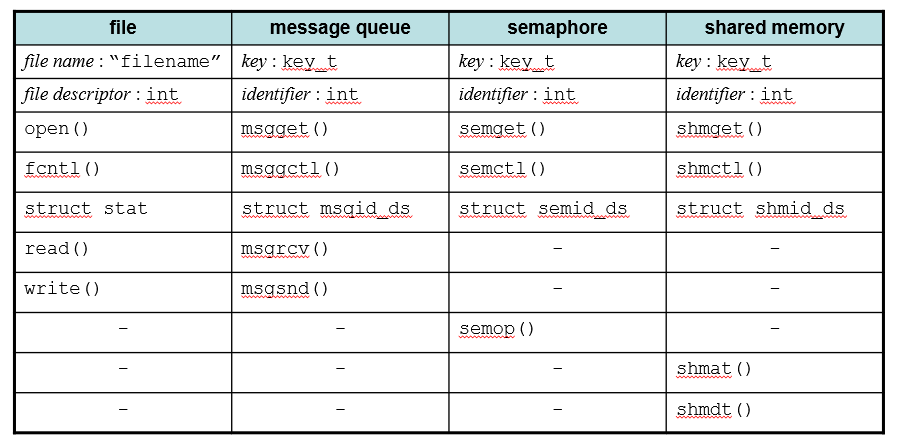
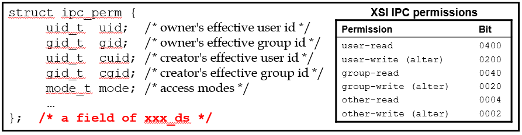
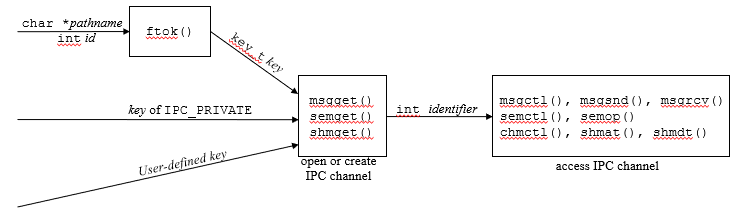
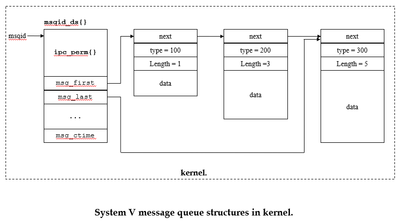
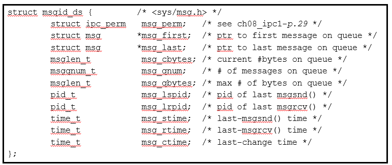
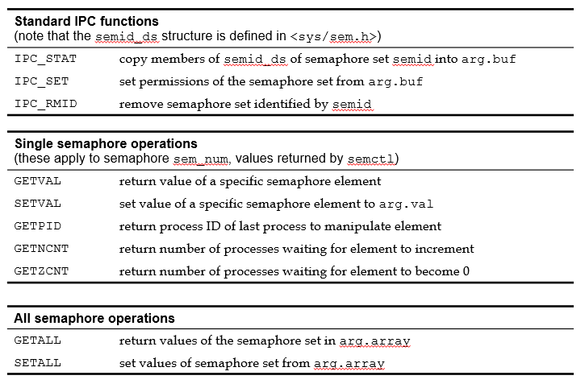

# Ch08 고급 프로세스간 통신

## 8.3 고급 IPC 설비

유닉스 시스템은 여러가지 Interconnection Process Communication 기능을 만들어서 프로그래머가 다양한 프로세스 통신 기능을 사용할 수 있도록 한다. 7장에서 배운 파이프와 FIFO와 함께 메시지큐, 세마포어, 공유 메모리가 IPC 기능을 위해 제공되고 있다.

### 8.2.1 서론과 기본 개념

메시지큐, 세마포어, 공유 메모리는 내부 구현 코드의 유사성을 반영하여 이들을 사용하는 인터페이스 또한 유사한 형태로 정의되어 있다.



#### IPC 설비 키

가장 중요한 공통 특성은 **IPC 설비 키**이다. 메시지큐, 세마포어, 공유 메모리를 사용하기 위해서는 먼저 이들을 unique하게 식별할 IPC 설비 키가 있어야 한다. IPC 설비 키는 파일의 이름과 유사하게 해당 IPC 설비를 유일하게 식별해준다. 이러한 key를 위해서 `key_t` 타입이 정의되어 있다. 파일 이름과 유사한 점이 있지만, IPC 설비들은 시스템 전체에서 한번에 관리되기 때문에 디렉토리 경로 지정을 통해서 동일한 이름을 부여할 수 있는 파일이름과는 약간의 차이점이 있다. 이와같은 특징 때문에 IPC 설비 키를 unique하게 설정하는 것이 중요한데, 다음과 같은 함수의 도움을 받을 수 있다.

```c
#include <sys/ipc.h>

key_t ftok(const char *path, int id);
```

위 함수는 특정 파일 경로와 연관된 유일한 IPC 설비키를 반환해준다. 파일의 경로는 시스템에서 유일하게 식별할 수 있다는 특성을 이용해서, 이 파일 경로 이름을 **seed 값** 삼아 IPC 설비키를 반환해준다고 생각하면 된다. 두번째 인자로 전달한 id도 일종의 seed 역할을 한다고 생각하면 된다.

만약 파일이 지워지고, 동일 경로 이름의 파일이 새로 생성되는 경우 ftok함수는 다른 값을 반환할 것이다. ftok 가 가장 유요한 응용분야는, 인자로 전달한 파일을 조작하는 데 IPC 설비를 사용할 경우나, 해당 파일이 영구적이면서 불변하는 화일의 이름이 주어진 경우이다.

#### IPC get 연산

프로그램은 IPC 객체를 생성하거나 기존의 것에 접근하려 할 때 키를 IPC 설비 키를 이용한다. 두 가지 옵션 모두 **IPC get 연산**으로 호출된다. get 함수의 결과로 IPC 설비들을 생성하면 정수형 **IPC 설비 식별자**라는 것이 반환된다. 이는 파일을 open하는 경우 반환되는 file descriptor와 유사하다. 그러나 차이점이 존재하는데, file descriptor가 해당 파일을 열었던 프로세스에서 유일하다면, **IPC 설비 식별자는 전체 시스템에서 유일하며, 또한 여러 프로세스에서 사용될 수 있다.**

#### 그밖의 IPC 연산

IPC 설비들을 조작하는 함수는 2가지로 나뉠 수 있다. IPC 설비의 상태 정보를 얻거나 제어값을 지정하는 제어 연산과, 각각의 IPC 설비들에만 존재하는 연산이 그것이다.

#### 상태 자료구조

파일의 stat 구조와 같이 IPC 설비들에도 해당 설비들에 관한 정보를 저장하는 구조가 있다. 이를 **IPC 설비 상태구조**라고 한다. 이 구조에는 IPC 설비의 허가와 관련된 멤버도 존재하는데, 이 멤버는 ipc_perm 으로 식별된다. 다시 ipc_perm 멤버는 다음과 같은 멤버들로 구성된다.



- **uid_t cuid** : IPC 객체 생성자의 사용자 식별번호
- **gid_t cgid** : 생성자의 그룹 식별번호
- **uid_t uid** : 유효 사용자 식별번호
- **gid_t gid** : 유효 그룹 식별번호
- **mode_t umode** : 허가

이들 멤버는 IPC 설비의 접근 제한에 대한 기준이 된다. umode는 파일의 permission과 동일한 역할을 한다. 주의할점은 umode와 함께 유효 사용자 식별번호와 유효 그룹 식별번호가 접근 권리를 결정한다는 것이다. 또한, 이 umode는 파일과는 다르게 umask값에 영향을 받지 않는다. 또 다른 점은 IPC 설비의 실행권한은 아무런 효과도 의미로 갖지 않는다.

### 8.3.2 메시지 전달

이제 메시지큐부터 시작하여 본격적으로 IPC 설비들의 사용법을 알아보자. 메시지큐는 프로세스들간의 메시지 교환을 가능하게 해주는 설비이다. 메시지는 대체로 문자열, 문자 데이터 바이트들을 의미한다. 하나의 프로세스가 msgsnd를 통해 메시지를 큐에 넣으면 다른 프로세스가 msgrecv를 통해 해당 메시지큐에서 메시지를 읽어 사용할 수 있으며 메시지는 큐에서 제거된다. 이는 파이프에서 제공하는 서비스와 유사함을 알 수 있다.

메세지큐를 사용하기 위해서는 우선 메시지큐를 만들어야 한다. 다음과 같은 함수를 이용하여 메시지큐를 만들 수 있다.

#### msgget

```c
#include <sys/msg.h>

int msgget(key_t key, int permflags);
```

- 인자
  - key : 메시지큐를 식별하는 메시지큐 설비 키
  - permflags : 허가모드와 실행방식 설정
- 반환값
  - 메시지큐 식별자 (음이 아닌 정수)

`msgget` 함수의 동작은 다음과 같다. 만약 인자로 전달한 key 의 설비 키를 가지고 있는 메시지큐가 이미 존재한다면 해당 메시지큐에 대한 메시지큐 식별자가 반환된다. 만약 key에 해당하는 메시지큐가 없다면, flag 조건값에 따라서 새로운 메시큐를 생성하거나, 함수 호출에 실패하게 된다. key값은 다음과 같이 3가지 방식으로 선택되어 전달될 수 있다.



- **IPC_PRIVATE** : 시스템이 유일한 설비 키를 선택하도록 함
- ftok 함수의 이용
- 프로그래머가 직접 사용할 키값을 정해서 전달

permflags에 전달할 수 있는 값은 다음과 같다. 이들은 독립적으로 사용되거나 비트별로 OR 될 수 있다.

- **IPC_CREAT** : 이것은 key에 해당하는 메시지 큐가 존재하지 않는 경우에 msgget이 이를 생성하도록 지시한다. 기존의 메시지 큐가 있는 경우에는 덮어 쓰지 않는다. IPC_CREAT이 설정되지 않는 경우, 그 키를 가진 메시지큐가 존재 하는 경우에만 메시지 큐 식별자를 반환한다.
- **IPC_EXCL** : 이 플래그가 IPC_CREAT과 함께 전달되는 경우, msgkey에 해당하는 메시지큐가 있다면 함수 호출에 실패한다. 이 때 오류 변수 errno에는 EEXIST 값이 저장된다. msgkey에 해당하는 큐가 없는 경우에만 새로운 메시지큐를 생성하고 식별자를 반환한다.

> 예시

```c
int id = msgget((key_t)0105, MSG_CREAT | MSG_EXCL | 0660);
```

#### 메시지 큐 연산들 : msgsnd, msgrcv

생성된 메시지큐를 사용하는 두 함수는 다음과 같은 형태로 정의되어 있다.

#### msgsnd

```c
#include <sys/msg.h>

int msgsnd(int mqid, const void * message, size_t size, int flags);
```

- 인자
  - mqid : 메시지큐 식별자
  - message : 전달할 메시지가 담긴 사용자 정의 타입 변수의 주소
  - size : 전달할 메시지의 문자열 길이
  - flags : 함수 동작 지정 플래그
- 반환값 : 성공시 0, 실패시 음수

사용자는 메시지를 전달하기 위해서 먼저 자신의 메시지에 대한 타입을 정의해야 한다. 다음과 같은 형태로 정의될 수 있다.

```c
struct my_message {
    long mtype;             /* 메시지 유형 */
    char message[MAXNUM];   /* 메시지 텍스트 */
}
```

**message**는 실제로 메시지를 넘길 사용자가 전달한 문자열을 담을 배열이고, MAXNUM은 가변적일 수 있다. 실제로 전달되는 메시지의 길이는 msgsnd의 인수 size에 의해 주어지며, 이 값의 범위는 0부터 시작해서, SOMEVALUE와 시스템이 결정한 최대값 중 작은 값까지가 된다. **mtype**은 메시지의 타입을 결정한다. 프로그래머는 **mtype** 필드를 사용하여 메시지를 분류할 수 있다. 여기서는 양의 정수만이 의미를 가지며 음의 정수와 0은 무의미하다. 이는 후에 msgrecv 함수의 4번째 인자와 일치하는 메시지만을 받아낼때 사용할 수 있다.

이 함수의 4번째 인자는 특정 조건에서의 msgsend 함수의 동작을 설명한다. 이 플래그에 **IPC_NOWAIT**가 설정된 경우 msgsend는 특정상황에서 block 되지 않고 바로 리턴한다. msgsend가 block될 수 있는 특정상황은 메시지큐에 담긴 메시지크기가 시스템 전체 허용량보다 커졌거나, 단일 메시지큐에 담을 수 있는 메시지 크기 제한에 도달할 경우다. IPC_NOWAIT 값 설정시 msgsnd 함수는 블럭되지 않고 -1을 곧바로 반환한다(errno 값에는 **EAGAIN**).

msgsnd는 또한 메시지 큐와 연관된 허가 때문에 실패할 수가 있다. 이 경우의 errno의 값은 **EACCES**가 된다.

메시지들은 커널 내에서 다음과 같이 리스트의 형태로 관리된다.



#### msgrcv

```c
#include <sys/msg.h>

int msgrcv(int mqid, void * message, size_t size, long msg_type, int flags);
```

- 인자
  - mqid : 메시지큐 식별자
  - message : 메시지를 담아올 사용자 정의 타입의 변수 주소
  - size : 담아올 메시지의 최대크기
  - msg_type : 이 인자로 전달한 타입과 일치하는 메시지큐의 맨 처음 저장된 메시지가 반환된다.
  - flags : 함수 동작 지정 플래그
- 반환값 : 성공시 0, 실패시 음수

이 함수의 4번째 인자인 type에 따라서 메시지 큐에서 읽어오는 메시지의 종류는 다음과 같이 나뉠 수 있다.

- **msg_type** == 0 : 큐의 맨 앞에 저장된 메시지를 읽어온다.
- **msg_type** > 0 : type 정수와 일치하는 mtype 값을 갖는 첫번째 메시지를 읽어온다.
- **msg_type** < 0 : type 값의 절대값 이하의 mtype 값을 갖는 메시지 중 최소값을 갖는 가장 첫번째 메시지를 읽어온다.

이 함수의 5번째 인자인 flags는 msgsend에서와 같이 함수의 실행 동작을 명세한다. 이 값에 **IPC_NOWAIT** 는 앞서 설명한대로 msgrecv가 block 될 수 있는 상황에서 block되지 않게 한다. msgrecv 함수는 메시지큐에 아무런 메시지가 없는 경우 block 된다. IPC_NOWAIT값 설정시 -1을 반환한다(errno 값에는 EAGAIN). flag값에 **MSG_NOERROR**라는 값을 설정할 수도 있다. 이는 msgrecv 함수에 설정한 size 값보다 메시지큐에 저장된 메시지의 길이가 긴 경우 함수 호출이 실패하지 않고 읽을 수 있는 길이만큼만 잘라서 저장하게 한다(원래는 -1을 호출하여 실패한다).

#### msgctl 시스템 호출

이번에는 메시지큐 관련 정보를 읽고, 수정하며, 또는 시스템 상에서 큐를 제거하는 함수에 대해서 알아보자.

```c
int msgctl(int mqid, int command, struct msqid_ds * msq_stat);
```

- 인자
  - mqid : 메시지큐 설비 식별자
  - command : msgctl를 통해 수행할 명령
  - msq_stat : 메시지큐의 상태정보가 저장된, 또는 상태 정보를 저장할 msqid_ds 형 버퍼 주소

3번째 인자는 msqid_ds는 아래의 구성원들을 포함하고 있다.



- **msg_perm** : 메시지큐의 허가 구조
- **msg_first** : 가장 첫번째 메시지 주소
- **msg_last** : 가장 마지막 메시지 주소
- **msg_cbytes** : 큐에 저장된 전체 메시지 길이
- **msg_qnum** : 큐에 저장된 메시지들의 개수
- **msg_qbytes** : 큐에 저장될 수 있는 최대 메시지 길이
- **msg_lspid** : 가장 마지막으로 msgsnd()를 호출한 프로세스 아이디
- **msg_lrpid** : 가장 마지막으로 msgrcv()를 호출한 프로세스 아이디
- **msg_stime** : 가장 마지막으로 msgsnd()를 호출한 시간
- **msg_rtime** : 가장 마지막으로 msgrcv()를 호출한 시간

msgctl의 command 인수는 수행될 작업을 시스템에 알려준다. 사용 가능한 값은 3개가 있는데 이들 전부가 IPC 설비 3개에 모두 적용될 수 있다.

- IPC_STAT : 메시지 큐의 상태정보를 msq_stat에 넣도록 시스템에 지시한다.
- IPC_SET : msg_stat에 있는 정보에 따라 메시지 큐에 대한 제어변수들의 값을 지정하기 위해 사용한다. 단지 아래의 사항들만 변경될 수 있다.
  - msq_stat.msg_perm.uid
  - msq_stat.msg_perm.gid
  - msq_stat.msg_perm.mode
  - msq_stat.msg_qbytes
  - msg_qbytes는 수퍼 사용자만이 변경할 수 있다. 또한 uid, gid, mode 값은 msg_perm의 uid로 설정된 사용자와 수퍼 사용자만이 변경할 수 있다.
- IPC_RMID : 메시지 큐를 시스템에서 삭제한다. 수퍼 사용자나 큐의 소유자만이 실행 할 수 있다. 만일 command가 IPC_RMID로 설정되어 있으면 3번째 인자 msq_stat에는 NULL을 전달한다.

### 8.3.3 세마포(Semaphore)

#### 이론적 구조체로서의 세마포

세마포는 유닉스에서 제공하는 또다른 IPC 설비이다. 세마포는 프로세스간에 데이터를 주고받는 용도 보다는 프로세스들의 **실행 순서의 동기화(Synchronization)나 상호 배제(Mutual Exclusion)** 를 위해서 사용된다. 세마포어는 네덜란드의 이론가 **다익스트라(E. W. Dijkstra)** 에 의해서 처음 고안되었다. 세마포어는 원래 같은 선로를 공유하여 다닐 수 있는 여러대의 기차가 서로 충돌하지 않고 선로에 진입할 수 있도록 기차들의 공유 선로 진입 순서를 결정하는 깃발이라는 의미로 사용되었다고 한다.

세마포어는 다음과 같은 연산을 수행할 수 있는 정수형 변수로 표현된다.

wait, P, lock

```c
void wait(semaphore * sp) {
    if (sp->value <= 0) {
        put this process to sp->list;
        block;
    }
    sp->value--;
}
```

signal, V, unlock

```c
void signal(semaphore * sp) {
    sp->value++;
    if (sp->list is not empty) {
        remove a first process from sp->list
        and put the process to ready list;
    }
}
```

세마포는 다음과 같은 수식을 항상 만족한다.

$$
(세마포어 초기값 + v 연산 수행 횟수 - p 연산 수행 횟수) >= 0
$$

세마포가 주로 사용되는 곳은 **상호배제(Mutual Exclusion)** 가 필요한 코드 영역이다. 어떤 임의의 코드 영역에 오직 하나의 프로세스만이 그 영역을 실행해야 할때 이 영역을 **임계영역(Critical section)** 이라고 하는데, 이 때 임계영역에 하나의 프로세스만이 들어갈 수 있도록 하는 것을 **상호배제(Mutual exclusion)** 라고 한다. 주로 다음과 같은 형태로 세마포를 이용해서 상호 배제를 구현한다.

```c
p(sem);

// critical section
...

v(sem);
```

#### semget 시스템 호출

Unix 시스템에서 세마포를 사용하기 위해서는 semget 연산을 통해서 먼저 세마포 설비를 생성하거나, 기존에 생성되어 있던 세마포 설비의 식별자를 가져와야 한다.

```c
#include <sys/sem.h>

int semget(key_t key, int nsems, int permflags);
```

- 인자
  - key : 세마포어 설비 키.
  - nsems : 생성할 세마포의 개수. semget 연산은 하나의 세마포가 아니라 여러개의 세마포에 대한 집합을 생성한다. 만약 기존에 있던 세마포를 가져오는 경우 이 값에 0을 할당한다.
  - permflags : 생성할 세마포 집합에 대한 허가와 semget 함수의 동작을 설정하는 플래그.

semget은 하나의 세마포를 생성하는 함수가 아니다. 이 함수의 2번째 인자 nsems 값으로 전달한 숫자만큼의 세마포를 만들어서 이 세마포들에 대한 집합의 식별자 - **세마포 집합 식별자** 를 반환한다. 이와 같은 특징 때문에 이 후에 설명할 세마포에 대한 인터페이스들이 상당히 복잡해지게 된다.

생성된 세마포 집합의 각 원소들은 다음과 같은 값들을 지니고 있는 `struct sem` 구조체 변수와 연관되어 있다.

```c
struct sem {
    ushort_t    semval;     // 세마포어 값. 음이 아닌 정수. 여기에 값을 새로 지정하려면 반드시 세마포 시스템 호출을 통해야 한다. (세마포는 한 프로그램에서 일반 자료형의 변수와 같이 직접 접근할 수는 없다.)
    short       sempid      // 마지막으로 semop 호출에 성공한 프로세스 아이디
    ushort_t    semncnt;    // 세마포 값이 현재보다 증가하기를 기다리고 있는 프로세스의 개수
    ushort_t    semzcnt;    // 세마포 값이 0이 되기를 기다리고 있는 프로세스 개수
};
```

또한 세마포 역시 메시지큐와 비슷하게 세마포와 관련된 정보를 저장하는 구조체 `struct semid_ds` 가 정의되어 있다.

```c
struct semid_ds {
    struct ipc_perm     sem_perm;   // 세마포 허가
    struct sem          *sem_base;  // 세마포 배열 포인터
    ushort_t            sem_nsems;  // 세마포 개수
    time_t              sem_otimes; // 마지막 semop 호출 시간
    time_t              sem_ctimes; // 마지막 수정 시간
}
```

#### semctl 연산

msgctl 과는 다르게 semctl은 유닉스 세마포의 특징때문에 상당히 복잡하다. 일단 semctl은 다음과 같은 형태로 정의되어 있다.

```c
#include <sys/sem.h>

int semctl(int semid, int sem_num, int command, union semun ctl_arg);
```

- 인자
  - semid : setget을 통해 반환받은 세마포 집합 식별자
  - sem_num : command가 적용될 세마포 집합 내의 원소 식별자. 개별 세마포에 적용되는 command시 유효함.
  - command : semctl을 이용해서 수행할 작업
  - ctl_arg : command에 따라서 역할이 달라짐.

이 함수의 3번째 인자로 전달할 수 있는 명령어의 종류에는 다음과 같은 것들이 있다.



마지막 인수 ctl_arg는 다음과 같이 정의되는 **유니온(union)** 이다. 이와 같은 유니온 구조는 세마포를 사용하기 위해서 사용자 프로그램에서 반드시 정의해야한다.

```c
typedef union _semun {
    int                 val;
    struct semid_ds     *buf;
    unsigned short      *array;
} semun;
```

유니온의 각 구성원은 세 가지 유형의 semctl 기능 각각에 대해 지정되는 다른 유형의 값을 나타낸다.

#### 세마포 연산 : semop 호출

semop 연산은 어떤 세마포 집합에 대해서 여러개의 세마포 연산을 한번의 시스템 호출을 통해서 수행할 수 있게 한다. semop 함수는 다음과 같이 정의되어 있다.

```c
#include <sys/sem.h>

int semop(int semid, struct sembuf * op_array, size_t numops);
```

- 인자
  - **semid** : 세마포 집합 식별자
  - **op_array** : 세마포 집합에 적용할 연산들에 대한 배열. 각각의 sembuf 구조는 한 세마포에 대해 수행할 연산에 대한 명세를 저장하고 있다.
  - **numops** : 두 번째 인자로 전달한 op_array 길이
- 반환값 : 성공시 0, 실패시 -1

semop 함수가 세마포 집합에 대해 수행하는 일련의 연산들은 모두 원자화되어야 한다. 즉, 그중의 한 연산이라도 수행할 수 없다면 전체 연산이 모두 수행되지 말아야 한다. 특별히 명시되지 않는한, 모든 연산이 한 번에 수행될 수 있을때까지 프로세스의 수행이 봉쇄된다.

이 함수의 2번째 인자로 전달한는 op_array 변수의 타입은 다음과 같은 형태로 정의되어 있다.

```c
struct sembuf {
    int     sem_num;
    int     sem_op;
    int     sem_flg;
}
```

sem_num은 해당 연산이 적용될 세마포 원소를 알려주는 식별자 역할을 한다. sem_op는 세마포에 적용할 연산을 나타낸다.

- sem_op < 0 인 경우 : semval(현재 세마포값) - abs(sem_op) 값이 0보다 작은 경우, 이 값이 0보다 크거나 같게 될 때까지 대기한다. 만약 0보다 크거나 같은 경우 현재 세마포 값에서 abs(sem_op) 값을 뺀다. 만약 sem_flags 값이 IPC_NOWAIT로 설정된 경우, 대기할 수 있는 상황에서 대기하지 않고 -1을 반환하여 바로 복귀한다.
- sem_op > 0 인 경우 : 현재 세마포값에 sem_op 값을 더한다. 이 때 해당 세마포의 값이 증가하기를 기다리는 프로세스들을 깨운다.
- sem_op == 0 인 경우 : 현재 세마포 값이 0이 될때까지 대기하게 된다. 만약 sem_flags 값이 IPC_NOWAIT로 설정된 경우, 대기할 수 있는 상황에서 대기하지 않고 -1을 반환하여 바로 복귀한다.

#### SEM_UNDO 플래그

이것은 sem_buf 구성요소의 sem_flg에 추가적으로 지정될 수 있는 또다른 플래그이다. 이는 프로세스가 퇴장할 때 수행된 연산을 시스템이 자동적으로 취소하도록 한다. 이는 프로세스마다 각 세마포에 **semadj** 값을 유지하면서 구현된다. sembuf의 sem_op값이 음수이면 semadj에 abs(sem_op) 만큼 더하고, sem_op 값이 양수이면 semadj에 sem_op 만큼 뺀다. 프로세스가 자발적 또는 비자발적으로 종료되는 경우 각 세마포값에 각각의 semadj 값을 더해줌으로서 여태까지 수행한 세마포 연산을 모두 취소 시킬 수 있다. 일반적으로, 프로세스가 지정한 값이 해당 프로세스의 종료 후에도 효력을 갖지 않는다면 SEM_UNDO가 사용되어야만 한다.

### 8.3.4 공유 메모리

공유메모리는 물리적 메모리의 일부분을 여러 프로세스가 공유해서 사용할 수 있도록 하는 IPC 설비이다. 공유 메모리를 포함해서 지금까지 소개한 IPC 설비중 공유 메모리는 가장 효율적인 기술이다. 일단 공유 메모리가 존재하면, 한 프로세스는 shmat를 이용하여 자기 프로세스를 공유 메모리에 부착해서 해당 메모리를 사용할 수 있고, 더이상 필요치 않게 되면 shmdt를 이용하여 자신을 떼어낼 수 있다.

공유 메모리는 여러 프로세스에서 동시에 접근할 수 있는 영역이기 때문에 반드시 세마포를 사용하여 프로세스가 공유 메모리를 접근하는 순서를 동기화 하던지, 상호배제를 보증하던지 해야한다.

#### shmget 시스템 호출

공유 메모리를 사용하기 위해서는 먼저 shmget 시스템 호출을 통해서 공유 메모리를 생성해야 한다.

```c
#include <sys/shm.h>

int shmget(key_t key, size_t size, int permflags);
```

- 인자
  - key : 공유 메모리 설비키
  - size : 메모리 영역의 필요한 최소 크기
  - permflags : 허가와 shmget 함수 동작 설정(IPC_CREAT, IPC_EXCL)
- 반환값 : 생성된 공유 메모리 설비 식별자

이 함수의 두번째 인자 size는 생성되는 공유 메모리의 바이트 크기를 지정한다.

#### 공유 메모리 연산 : shmat와 shmdt

생성된 공유 메모리를 사용하기 위해서는 먼저 프로세스를 공유 메모리에 부착해야 한다. shmget으로 생성한 메모리는 물리적 메모리의 일부이며 프로세스의 논리적 메모리 단위에 포함되지 않는다. 따라서 shmat를 이용하여 이 메모리 영역을 자신의 논리적 자료 공간에 명시적으로 부착해야한다.

```c
int *shmat(int shmid, const void *daddr, int shmflags);
```

- 인자
  - shmid : shmget으로 공유 메모리를 생성하고 나서 반환받은 공유메모리 설비 식별자
  - 2번째, 3번째 인자는 보통 0(또는 NULL)로 지정한다. 추가적인 설정을 제공한다. 자세한 내용은 책 참조
- 반환값 : 성공시 프로세스에 첨부된 공유 메모리 주소, 실패시 (void*)-1

공유 메모리에 부착된 프로세스를 떼어내기 위해서는 다음과 같은 함수가 사용된다.

```c
int shmdt(int shmid);
```

- 반환값 : 성공시 0, 실패시 -1

#### shmctl 시스템 호출

```c
#include <sys/shm.h>

int shmctl (int shmid, int command, struct shmid_ds *shm_stat);
```

이 시스템 호출을 앞선 메시지큐와 세마포 ctl 연산과 유사하다.
